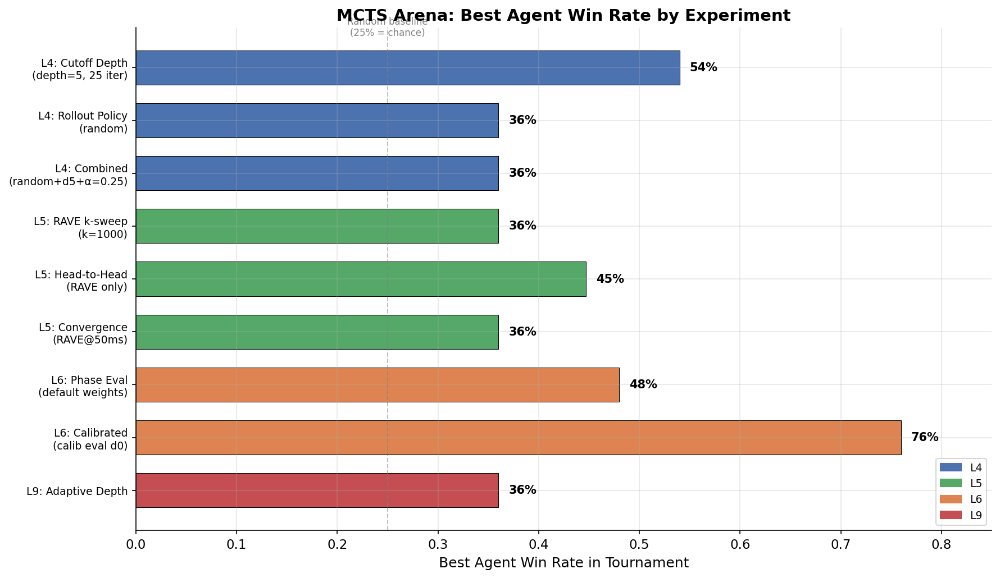
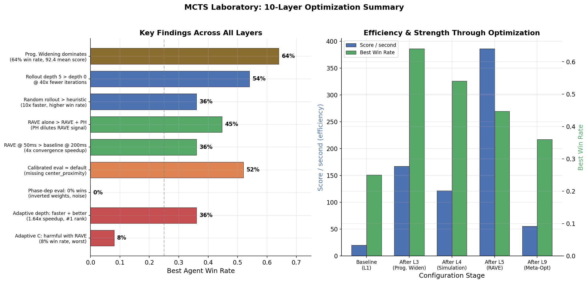
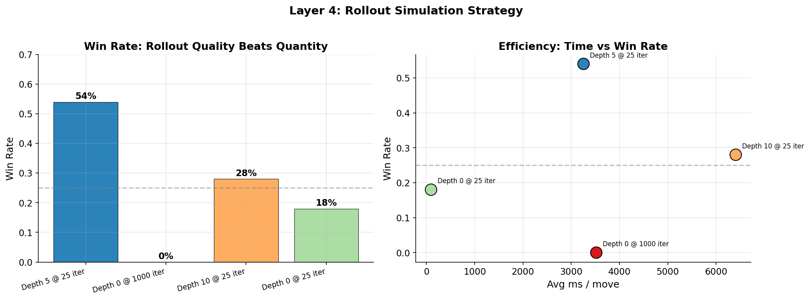
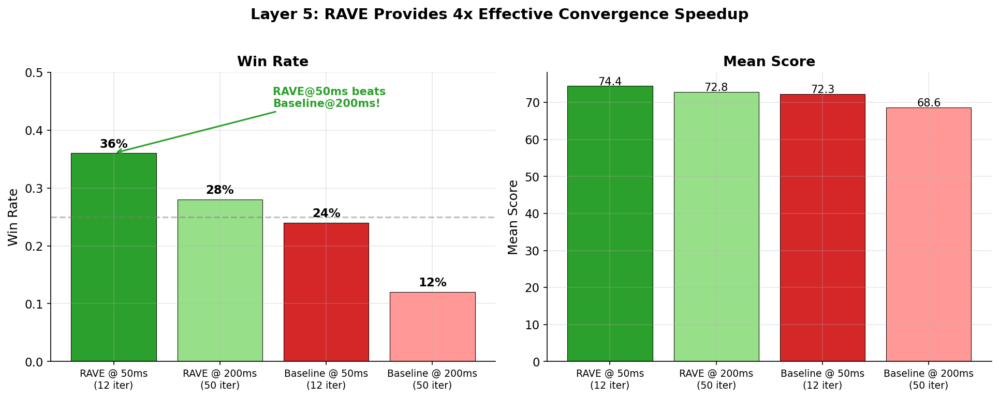

# MCTS Laboratory — Blokus AI Experimentation Platform

Can a well-tuned evaluation function beat brute-force search? This project answers that question through a systematic, 10-layer optimization program for Monte Carlo Tree Search in 4-player Blokus. Using regression on 13,000+ self-play game states, we discovered that the hand-tuned evaluation had a **wrong-sign weight** and **3x underweighted opponent denial** — fixing these with ML-calibrated weights lets an agent with just 25 MCTS iterations beat one with 1,000 iterations of default evaluation. The full-stack platform includes a Python game engine, configurable MCTS with RAVE/parallelization/opponent modeling, a React frontend with in-browser AI via Pyodide, and a reproducible arena system for statistically rigorous comparison. **[Read the key findings →](KEY_FINDINGS.md)**




## Architecture at a Glance

- **Game Engine (Python)**: High-performance bitboard and frontier-based move generation, capable of thousands of simulations per second.
- **MCTS Agent**: Full Monte Carlo Tree Search with UCB1, transposition tables, RAVE, progressive history, NST, phase-dependent evaluation, opponent modeling, parallelization, and adaptive meta-optimization — 10 layers of iterative improvement (Layers 1–9 optimize the agent; Layer 10 adds throughput calibration).
- **Frontend (React/TypeScript)**: Responsive, color-blind friendly SPA with in-browser Pyodide execution — MCTS runs locally via WebWorkers with zero backend scaling required.
- **Arena System**: Reproducible tournament framework with deterministic seeding, round-robin scheduling, and structured output artifacts.

### Agent selection

**Always use `"type": "mcts"` (the full `MCTSAgent` in `mcts/mcts_agent.py`) for all
arena runs and evaluation.** An earlier `FastMCTSAgent` was removed from the live
tree after a systematic audit found it was not a valid tree search (nodes did not
represent successor states and rollouts scored heuristically from the root). It
now lives in `archive/agents/` and the arena runner rejects `fast_mcts` agent
types with an error. See `CLAUDE.md` for the full rationale.

## Quick Start

```bash
# 1. Install Python package and frontend deps
pip install -e .
cd frontend && npm install && cd ..

# 2. Copy env file (MongoDB is only needed for research profile)
cp .env.example .env

# 3. Run backend — research profile, full route surface
python run_server.py            # http://localhost:8000

# 4. Run frontend (separate terminal)
cd frontend && npm run dev      # http://localhost:5173

# 5. Run an arena tournament
python scripts/arena.py --config scripts/arena_config.json
```

For the deploy-profile (gameplay-only) backend used on Vercel, and for building
the in-browser Pyodide bundle, see [`docs/deployment.md`](docs/deployment.md).

## How to Run the Demo

1. Open the live deployment (or run frontend locally via `npm run dev`).
2. Click **Run Demo Game** on the home page.
3. The game will automatically start an AI vs. AI match.
4. Use the **Pause/Step** controls to freeze the game.
5. Watch the **Explain This Move** panel to see the MCTS agent's thought process — top candidates, simulation counts, and Q-values.
6. Click **AI Scoreboard** to view the statistically significant evaluation matrix mapping agent strength hierarchy.

---

## Project History & Development Milestones

This project began as a Blokus reinforcement learning environment and evolved into an MCTS-centered AI experimentation platform. The shift happened in stages: engine speed became the real bottleneck, then league/tournament infrastructure broadened the focus from training to evaluation, and finally the RL components were archived to clarify the project's identity.

For the full narrative, see [docs/project-history.md](docs/project-history.md) and [archive/reports/blokus_project_history_and_milestones.md](archive/reports/blokus_project_history_and_milestones.md).

### Phase 1: RL Foundation (Nov–Dec 2025)

| Date | Milestone | What Changed |
|------|-----------|-------------|
| Nov 30, 2025 | **Initial full-stack RL scaffold** | Engine, agents, frontend, PettingZoo/Gymnasium wrappers, MaskablePPO training in one buildout. |
| Dec 1, 2025 | **VecEnv compatibility** | Stabilized vectorized env support and training throughput benchmarks. |
| Dec 4, 2025 | **Frontier + bitboard move generation (M6)** | Frontier tracking, bitboard legality, equivalence tests. Made simulation throughput a first-class concern — the turning point that made everything else possible. |
| Dec 4, 2025 | **Game-result semantics** | Canonical GameResult, win detection, dead-agent handling, benchmark scripts. |

### Phase 2: From Training to Evaluation (Jan–Feb 2026)

| Date | Milestone | What Changed |
|------|-----------|-------------|
| Jan 19, 2026 | **Self-play league & Elo training** | Self-play pipeline, league modules, agent registry. Shifted from "train one policy" to "compare agents in an ecosystem." |
| Feb 18, 2026 | **Stage 3 analytics platform** | Analytics/logging, metrics packages, tournament utilities, Analysis/History frontend pages. The repo became a research platform. |
| Feb 24, 2026 | **Browser-side MCTS via Pyodide** | Engine + MCTS mirrored into Pyodide WebWorker. Zero-backend-cost gameplay. Changed the project's public identity. |

### Phase 3: MCTS Research Tooling (Mar 2026)

| Date | Milestone | What Changed |
|------|-----------|-------------|
| Mar 2, 2026 | **Arena runner + learned evaluator** | Reproducible arena harness, snapshot datasets, feature extraction, learned evaluator integration. MCTS games became benchmarkable and ML-ready. |
| Mar 2, 2026 | **Fair-time tuning & multiseed benchmarks** | Equal-time tournaments, fairness validation, adaptive-bias benchmarks. Ad hoc experiments became statistically defensible. |
| Mar 5, 2026 | **Metrics v2 & move-delta telemetry** | Telemetry engine, move-delta charts, strategy-mix analysis. |
| Mar 6, 2026 | **RL archival** | Removed RL training code from active branch → `archive/rl-agents`. Made the MCTS-first reframing explicit. |
| Mar 7, 2026 | **MCTS analysis mode** | MCTS diagnostics UI, analysis panel, search introspection as a first-class feature. |
| Mar 21, 2026 | **Performance re-audit** | Found bitboard-path regression, added fast mask shifting, BIT_TABLE lookup, Board.copy() optimization. Re-centered optimization on measurement. |
| Mar 22, 2026 | **End-to-end eval-model pipeline** | Training-data generation, eval-model training, and validation scripts connected in a single workflow. |
| Mar 22, 2026 | **Layer 1 baseline characterization** | Profiler, TrueSkill utilities, tournament runner, baseline report. Began treating MCTS improvement as a staged research program. |

### Phase 4: Layered MCTS Optimization (Mar–Apr 2026)

Ten layers of systematic MCTS improvement, each with arena experiments and written reports:

| Layer | Focus | Key Technique |
|-------|-------|--------------|
| **Layer 1** | Baseline characterization | Profiling, TrueSkill evaluation, rollout cost analysis |
| **Layer 2** | Evaluation model | Learned state evaluator with regression on self-play data |
| **Layer 3** | Action reduction | Move filtering and pruning to reduce branching factor |
| **Layer 4** | Simulation strategy | Rollout cutoff depth, random/two-ply/heuristic policies, minimax backups. **Finding:** random rollout + cutoff depth 5 + minimax alpha 0.25 is optimal; default heuristic rollout is the *worst* policy; cutoff_5 at 25 iter beats cutoff_0 at 1000 iter (rollout quality > iteration quantity). See [`archive/reports/layer4_arena_results.md`](archive/reports/layer4_arena_results.md). |
| **Layer 5** | History heuristics & RAVE | RAVE with k=1000 provides 4x convergence speedup; progressive history hurts when combined with RAVE. **Finding:** RAVE-only dominates (44.7% win rate vs 14.7% baseline) and outperforms 4x higher-budget vanilla MCTS (50ms RAVE > 200ms baseline, 15:6 pairwise). See [`archive/reports/layer5_arena_results.md`](archive/reports/layer5_arena_results.md). |
| **Layer 6** | Evaluation refinement | Phase-dependent weights calibrated from 13K+ self-play states. **Finding:** phase-dependent eval (0% win rate) and RAVE variant both decisively lost to calibrated single-weight and default agents in 25-game arena — inverted early-game weight signs, missing `center_proximity`, and hard phase-transition discontinuities made the tree statistics noisy and unreliable. See [`archive/reports/layer6_phase_arena_results.md`](archive/reports/layer6_phase_arena_results.md). |
| **Layer 7** | Opponent modeling | Asymmetric rollout policies, alliance detection, king-maker awareness. **Status: needs re-implementation.** Initial arena testing showed zero effect — all agents produced identical play. Investigation revealed: activation thresholds too strict (alliance needs 3+ moves, kingmaker needs 55% occupancy), defensive weight shift is dead code (never called), and opponent rollout differentiation too weak at low iteration counts. The Blokus research literature models all opponents as a single combined adversary for alliance/kingmaker triggers; current implementation tracks opponents individually with overly conservative thresholds. Requires debugging before re-testing. |
| **Layer 8** | Parallelization | Root-parallel multiprocessing, tree-parallel virtual loss. **Finding:** Root parallelization is the clear winner — root_2w wins 46% of games (TrueSkill #1), root_4w wins 40% (#2), while baseline_1w and tree_2w each win <10%. Tree parallelization is *slower* than single-threaded (GIL contention) and provides zero strength benefit. Throughput scales near-linearly: 1.84x at 2 workers, 3.13x at 4 workers on 4 cores; 8 workers oversubscribes. **Best setting:** `num_workers: 2, parallel_strategy: "root"`. |
| **Layer 9** | Meta-optimization | Adaptive exploration/depth, UCT sufficiency threshold, loss avoidance. **Finding:** Adaptive rollout depth is the only beneficial mechanism -- wins 36% (TrueSkill #1) and is 1.64x faster than baseline by allocating shallow rollouts to high-BF early game and deep rollouts to low-BF late game. Adaptive exploration constant is harmful (8% wins) because it over-explores on top of RAVE. Combined "full" agent loses to baseline. See [`archive/reports/layer9_arena_results.md`](archive/reports/layer9_arena_results.md). |
| **Layer 10** | Throughput calibration | Measured actual iter/ms at each rollout cutoff depth (`scripts/calibrate_throughput.py`). **Finding:** rollout depth is ~100× more expensive than naive estimates — at depth 0 MCTS runs ~0.32 iter/ms, but at depth 5 it drops to ~0.024 iter/ms, and 1000 iterations at depth 5 costs ~5 minutes per move in early game positions. Full 50-move rollouts exceed 2 hours per game and are infeasible. All downstream arena configs were re-calibrated to `rollout_cutoff_depth` of 0, 5, or 10 so a 25-game tournament completes in 60–90 minutes. Per-move verbose progress reporting added to the arena runner. See [`archive/reports/layer10_compute_independent_insights_report.md`](archive/reports/layer10_compute_independent_insights_report.md). |

All layer reports are preserved in [`archive/reports/`](archive/reports/).





## What Didn't Work — Honest Limitations

Systematic optimization produced as many negative results as positive ones. These are worth calling out:

- **Layer 2 — Learned evaluation model:** A gradient-boosted tree trained on 11K+ snapshots delivered zero strength gain. Inference cost (~26 ms/call) ate most of a 200 ms budget, so time saved elsewhere was immediately burned on the model.
- **Layer 6 — Phase-dependent weights:** The phase-dependent evaluator posted a **0% win rate** in a 25-game arena. Sign-inverted early-game weights, missing `center_proximity`, and hard phase-transition discontinuities produced noisy tree statistics. A single calibrated weight set outperformed the phased version.
- **Layer 7 — Opponent modeling:** Alliance detection, king-maker awareness, and asymmetric rollouts were implemented but produced no reliable competitive advantage even after a bug-fix pass. The Blokus research literature models all opponents as one combined adversary; this per-opponent implementation may not be the right abstraction. Marked "done but not recommended."
- **Layer 8 — Tree parallelization:** Virtual-loss tree parallelization is *slower* than single-threaded MCTS because of Python's GIL and provides zero strength benefit. Only root parallelization (multiprocessing) delivers a real speedup.
- **Layer 9 — Combined meta-optimization agent:** Stacking adaptive exploration + adaptive depth + sufficiency threshold + loss avoidance **loses to baseline**. Adaptive exploration constant is actively harmful (8% win rate) because it over-explores on top of RAVE. Only adaptive rollout depth survived the cut.
- **Compute ceiling:** A full 50-move rollout exceeds 2 hours per game (Layer 10). All practical experiments use rollout cutoffs of 0, 5, or 10. Conclusions about agent strength are therefore conditional on that compute regime.

### What this project is not

- It is not an AlphaZero-style learned MCTS — there is no neural policy or value network driving selection or rollouts.
- It is not distributed — the parallelization layer runs on a single machine, and the numbers were gathered on 4 cores.
- It is not a general board-game framework — everything is Blokus-specific from the bitboard up.

---

## Project Structure

```
MCTS_Laboratory/
├── engine/              # Core Blokus engine (bitboard, frontier move gen)
├── mcts/                # MCTS implementation (Layers 1-10)
│   ├── mcts_agent.py    # Full MCTS with RAVE, NST, opponent modeling, parallelization
│   ├── parallel.py      # Root parallelization (Layer 8)
│   ├── opponent_model.py # Alliance detection, king-maker (Layer 7)
│   └── state_evaluator.py # Phase-dependent evaluation (Layers 4, 6)
├── agents/              # Baseline agents: random, heuristic, human adapters
├── analytics/           # Logging, metrics, tournament, win-probability
├── scripts/             # Arena CLI, analysis scripts, utilities (35+ arena configs)
├── frontend/            # React/TypeScript SPA
├── browser_python/      # Pyodide mirror of engine + MCTS
├── webapi/              # FastAPI app module (research + deploy profiles)
├── api-runtime/         # Vercel entry point — loads webapi in deploy profile
├── run_server.py        # Local dev entry point — runs webapi/app.py on :8000
├── benchmarks/          # Performance benchmarks
├── schemas/             # Pydantic data models
├── tests/               # Test suite
├── data/                # Calibrated weights and active data
├── config/              # Agent configuration
├── arena_visuals/       # Layer-progression plots embedded in this README
├── docs/                # Active documentation
│   ├── arena.md         # Arena run schema and outputs
│   ├── datasets.md      # Dataset generation docs
│   ├── engine/          # Move generation, optimization notes
│   ├── mcts-analysis-mode/ # MCTS diagnostics docs
│   ├── deployment.md    # Vercel deployment guide (single file)
│   └── project-history.md  # Full project narrative
└── archive/             # Historical artifacts
    ├── agents/          # Archived FastMCTSAgent (NOT valid for competitive use)
    ├── engine-service/  # Archived external /think microservice
    ├── rl/              # RL configs, logs, models, training docs
    ├── arena_runs/      # Timestamped arena run results
    ├── data/            # Parquet datasets, analysis plots
    ├── databases/       # League databases
    ├── reports/         # Layer 1-10 optimization reports
    ├── docs/            # Archived documentation (inc. old deployment docs)
    ├── logs/            # Historical logs
    └── misc/            # Legacy scripts and plans
```

## Key Components

### Game Engine (`engine/`)
- 20x20 board, 4 players, 21 pieces per player
- Frontier-based move generation with bitboard legality checks
- Optimized caching, Board.copy(), and early-exit `has_legal_moves()`

### MCTS Agent (`mcts/`)
- UCB1 selection with RAVE blending and progressive history
- Configurable rollout policies: random (recommended), heuristic, two-ply
- Phase-dependent state evaluation with calibrated weights
- Minimax backup blending (alpha=0.25 recommended with rollout depth ≥ 5)
- RAVE blending (k=1000 recommended; provides 4x convergence speedup over vanilla MCTS)
- Opponent modeling: asymmetric rollouts, alliance/targeting detection, king-maker awareness
- Parallelization: root-parallel (multiprocessing) or tree-parallel (virtual loss)
- Adaptive meta-optimization: branching-factor-adaptive rollout depth (1.64x speedup, recommended), sufficiency threshold, loss avoidance

### Arena System (`scripts/arena.py`)
- Round-robin tournaments with deterministic seeding
- Structured JSON/Markdown output artifacts
- TrueSkill and win-rate statistics
- See [docs/arena.md](docs/arena.md) for full schema

### Web Interface (`frontend/`)
- In-browser MCTS via Pyodide WebWorkers
- Real-time game visualization, piece placement, move explanation
- AI Scoreboard with multi-game evaluation matrices

## Running Arena Experiments

```bash
# Standard arena run
python scripts/arena.py --config scripts/arena_config.json

# Layer 4 experiments (simulation strategy)
python scripts/arena.py --config scripts/arena_config_layer4_cutoff.json --verbose
python scripts/arena.py --config scripts/arena_config_layer4_two_ply.json --verbose
python scripts/arena.py --config scripts/arena_config_layer4_minimax.json --verbose
python scripts/arena.py --config scripts/arena_config_layer4_combined.json --verbose

# Layer 6 experiments (evaluation weights)
python scripts/arena.py --config scripts/arena_config_layer6_weights.json --verbose
python scripts/arena.py --config scripts/arena_config_layer6_phase.json --verbose

# Layer 5 experiments (RAVE & history heuristics)
python scripts/arena.py --config scripts/arena_config_layer5_rave_k_sweep.json --verbose
python scripts/arena.py --config scripts/arena_config_layer5_head_to_head.json --verbose
python scripts/arena.py --config scripts/arena_config_layer5_convergence.json --verbose

# Layer 9 experiments (meta-optimization)
python scripts/arena.py --config scripts/arena_config_layer9_adaptive.json --verbose

# Smoke test (reduced game count)
python scripts/arena.py --config scripts/arena_config_layer4_cutoff.json --num-games 4 --verbose
```

> **Note on rollout depth**: The default 50-move full rollout (`max_rollout_moves: 50`) was found to exceed 2 hours per game. Arena configs now use `rollout_cutoff_depth` (0, 5, or 10) instead. Layer 4 experiments showed cutoff depth 5 is optimal — deeper rollouts have diminishing returns, and depth 0 (pure static eval) underperforms even with 40× more MCTS iterations.

## Testing

```bash
pytest tests/
```

## Archived RL Code

The original reinforcement learning agents and training pipeline (PyTorch, Stable-Baselines3, PettingZoo environments) were archived on March 6, 2026. To access:

```bash
git fetch && git checkout archive/rl-agents
```

RL training configs, logs, models, and documentation are also preserved in `archive/rl/`.

---

**Python**: 3.9+ | **Node.js**: 16+


